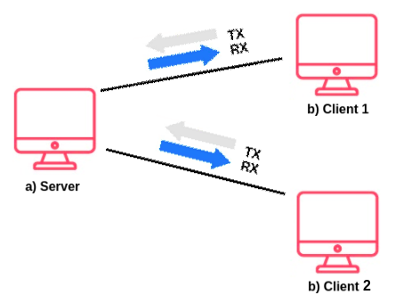

# Chat en Python

## Planteamiento

### ¿En qué consiste?

La prueba consistiría en realizar un chat entre dos PC usando Python en una arquitectura clientes/servidor.

Script a) - Servidor

Script b) - Clientes

El objetivo es que 2 clientes se conecten al servidor, y a partir de ahí, ambos puedan intercambiarse mensajes.

Todos los mensajes, los debes guardar en un log de mensajes.

Los mensajes que se envian deben ser de forma asíncrona (enviar mensajes sin necesidad de una recepción previa).

### Puntos Clave

- Buenas prácticas de programación.
- Control de errores
- Código comentado (inglés).
- Estructura de código (estructuración de clases, etc).
- Sistema dockerizado (separar docker servidor y docker cliente).

## Desarrollo

### Servidor

Para comenzar se ha creado el [servidor](./server/Server.py), donde se administra las conexiones de los usuarios, reenvía los mensajes a los clientes y guarda los mensajes recibidos en el archivo llamado ***chat_history.log***.

Para llevar a cabo las conexiones, se ha utilizado la clase socket, con la configuración: `socket(socket.AF_INET, socket.SOCK_STREAM)`; donde el argumento `socket.AF_INET` especifica que se utilizará la familia de direcciones de Internet IPv4. El argumento `socket.SOCK_STREAM` nos especifica que estamos ante un socket de flujo. Los socket de flujo proporcionan una conexión bidireccional y confiable entre dos programas, utilizando el protocolo TCP.

Otra característica del Script de Servidor es la capacidad de guardar los mensajes recibidos en un archivo de logs `chat_history.log`. Los mensajes se guardarán con la hora de llegada al servidor justo antes de mandarlos al resto de usuarios. De esta manera nos aseguramos que siempre tenemos los mensajes guardados aunque se desconecte algún receptor.

### Cliente

El siguiente paso fue crear el [cliente](./client/Client.py), que es capaz de recibir y enviar mensajes de forma asíncrona. Para solucionar este problema se usa la clase **ThreadPoolExecutor**, que permite utilizar diferentes hilos para todas las acciones y conseguir recibir y/o enviar mensajes sin tener que esperar a que termine otro proceso.

El primer paso fue configurar el socket para que pueda conectar con el servidor. Posteriormente nos conectamos al servidor usando la dirección IP y el puerto correspondiente.
A la hora de enviar o recibir los mensajes, se ha optado por el uso de dos hilos Threadpoolexecutor, uno para la función de recibir y otro para la de enviar.

### Común

Para terminar, se ha creado un archivo ***main.py*** para cada servicio, de cara a poder parametrizarlo a la hora de elegir la dirección IP del servidor.

## Docker

Se han creado dos archivos dockerfile, uno en cada carpeta para crear las imagenes.
Para ejecutar los docker, se han usado los siguientes comandos sobre los ficheros dockerfile:

Server: `docker run -it -p 12345:12345 --name=pychat-server --network=chatNetwork pychat-server`

Clients: `docker run -it --network chatNetwork pychat-client pychat-server`

## Fuentes documentales

- [Documentación Python Sockets](https://docs.python.org/es/3/howto/sockets.html)
- [Libro Python Avanzado](https://www.amazon.es/Python-avanzado-en-fin-semana/dp/B08XLGJQQG/ref=tmm_pap_swatch_0?_encoding=UTF8&qid=&sr=)
- [Documentación Python Threadpoolexecutor](https://docs.python.org/3/library/concurrent.futures.html#threadpoolexecutor)
- [Video explicando ThreadPoolExecutor](https://www.youtube.com/watch?v=2Koubj0fF9U)
